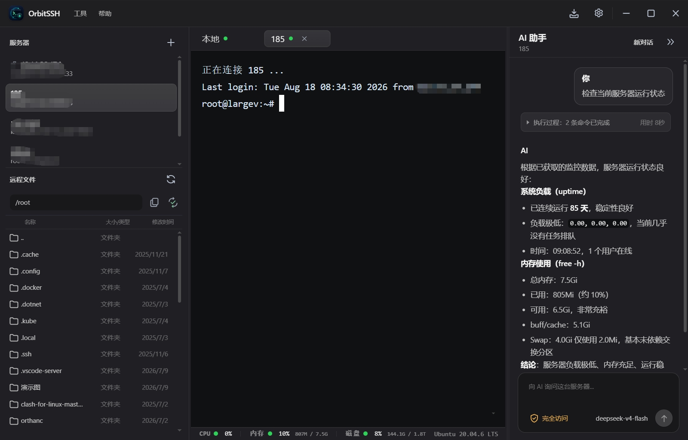
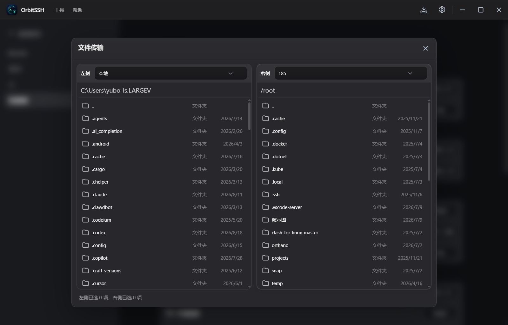
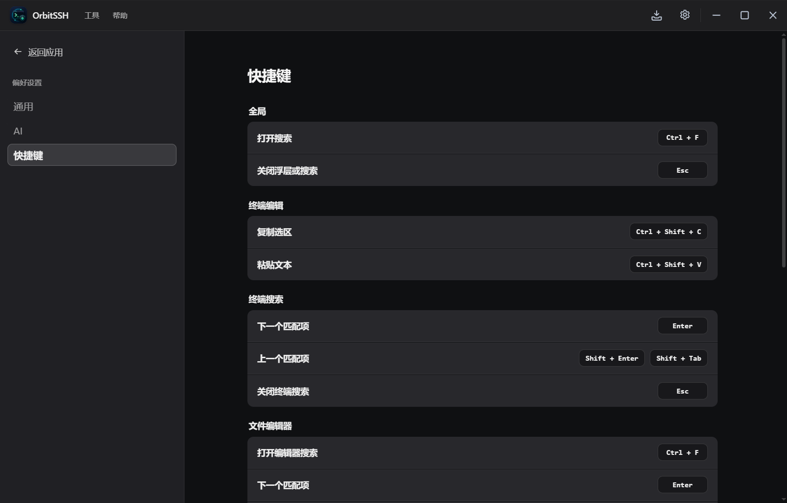

<p align="center"></p>

<h1 align="center">OrbitSSH</h1>

<p align="center"><strong>Modern · Performant · Controlled AI Operations</strong></p>

<p align="center">
  
  
  
  
  
</p>

<p align="center"><a href="README.md">简体中文</a> | English</p>

## Overview

OrbitSSH brings SSH terminals, SFTP file management, server-to-server transfers, reusable automation tasks, and AI-assisted diagnostics into one desktop application. Electron's main process owns SSH, SFTP, file, and AI command execution; the Vue renderer is limited to presentation and interaction.

The repository provides a Windows installer and macOS packaging script. Development requires Node.js 22 or later.

## Screenshots

| Terminal | SFTP file transfer | Settings |
| :---: | :---: | :---: |
|  |  |  |

## Features

### SSH terminal

- Remote SSH and local terminals with parallel, multi-tab sessions.
- xterm.js rendering with automatic resizing, terminal search, selection-to-copy, and right-click paste.
- Reconnect support plus configurable SSH/SFTP keepalive and idle-disconnect intervals.
- Terminal paths are synchronized to the file panel and AI context; when unknown, AI commands run in the login default directory.

### SFTP and transfers

- Local and remote file browsing, create, rename, delete, image preview, and remote text editing.
- File and directory upload/download with drag and drop, progress, pause, resume, and cancel controls.
- Local-to-remote directory sync with selectable differences.
- Server-to-server transfers relay through the local app; the two servers do not need to SSH to each other.
- Stable large files with matching SHA-256 fingerprints can skip repeated transfer. Temporary files and resume logic reduce interruption impact.

### Servers and automation

- Saved password- or private-key-based connection profiles, with pinning for frequent servers.
- Passwords and private-key passphrases are encrypted with Electron `safeStorage`. Private-key contents are never written to app configuration and are read from the user-selected file only when connecting.
- Per-server reusable scripts run through separate SSH connections, with live stdout/stderr and manual cancellation.

### AI operations assistant

- A separate AI conversation for every terminal tab keeps server contexts isolated.
- OpenAI-compatible providers and the local Codex CLI are supported; Codex CLI acts only as a read-only planning provider.
- Streaming replies, Markdown rendering, and command-card states: approval required, running, completed, failed, rejected, or cancelled.
- The model can request only a command in the current terminal or on a saved server explicitly named by the user. SSH/SCP/SFTP hopping through the current terminal is blocked.
- Permission modes:
  - `ask`: every command needs confirmation.
  - `auto`: identified high-risk operations and sensitive reads need confirmation; low- and medium-risk commands can run automatically.
  - `full_access`: syntactically valid commands run without approval.
- The main process checks syntax, compound commands, sensitive data sources, and high-risk operations. User approval cannot override a syntax-level denial.
- Terminal output, tool results, and common credential patterns are redacted and length-bounded. Sharing recent terminal output with an online model is disabled by default.
- Each turn is bounded by command count, elapsed time, repeated-command checks, and no-progress detection. Requests and running commands can be cancelled.

### Appearance and app behavior

- Dark/light themes plus terminal font size, line height, and selection color settings.
- Server, automation, and remote-file panels support ordering, collapsing, and resizing.
- System tray, single-instance startup, Windows startup diagnostics, and `electron-updater` update checks with download progress.

## Architecture

```text
Renderer: Vue 3 + Pinia
Terminal / SFTP / Automation / Settings / AI UI
                │ contextBridge IPC
Preload: restricted, explicit API surface
                │
Main process: SSH · SFTP · transfer queue · automation
              AI Agent · policy · approval · storage · updater · logging
```

- `contextIsolation: true`, `sandbox: true`, and `nodeIntegration: false`; the renderer has no direct Node.js or SSH access.
- The main process validates IPC inputs and session ownership before handling SSH/SFTP state, file access, and AI tool execution.
- The AI model proposes a reply or structured tool request; local code makes permission decisions and performs actual execution.

## Tech stack

| Layer | Technology |
| --- | --- |
| Desktop app | Electron 37, TypeScript |
| UI | Vue 3, Pinia, Vite |
| Terminal | xterm.js, Canvas addon, node-pty |
| SSH / SFTP | ssh2, ssh2-sftp-client |
| Editor and Markdown | CodeMirror 6, markdown-it, DOMPurify |
| Local storage | electron-store, Electron safeStorage |
| Packaging and updates | electron-builder, electron-updater |

## Getting started

Prerequisites: Node.js 22+ and npm 9+.

```bash
git clone https://gitee.com/ksdhy/orbit-ssh
cd orbitssh
npm install
npm run dev:electron
```

```bash
# Vue type check, renderer build, Electron main-process compilation, and Preload sync
npm run build

# AI, SFTP, and renderer tests
npm run test:ai
npm run test:sftp
npm run test:renderer

# Windows installer / macOS package
npm run dist
npm run dist-mac
```

## Usage

### Connections and files

1. Add a name, host, port, username, and password or private-key authentication in the server panel.
2. Save the profile and select it to open an SSH terminal. Tab actions can close or reconnect it.
3. Open the SFTP panel to browse files and drag files or directories between local and remote panes to transfer them.
4. Double-click a supported remote text file to edit and save it back; Sync compares directory differences before selected transfer.

### AI

1. In **Settings → AI**, enable AI and add an OpenAI-compatible configuration, or detect and configure the local Codex CLI.
2. Choose a permission mode suited to the server's risk level; `ask` is recommended for production servers.
3. Open the AI panel next to a connected terminal and describe the symptom or goal.
4. When approval is required, review the target server, working directory, command, and risk explanation before approving.
5. To share recent terminal output with the model, enable the option in Settings. Output is redacted and truncated first.

## Project layout

```text
orbitssh/
├── src/
│   ├── main/          Electron main process: SSH, SFTP, AI, IPC, storage, updates, logs
│   │   ├── ai/        Agent, providers, command policy, approvals, execution budgets
│   │   ├── automation/ saved server-script execution
│   │   ├── ipc/       restricted Renderer-to-main interfaces
│   │   ├── sftp/      sessions, upload, download, sync, server-to-server transfer
│   │   ├── ssh/       terminal sessions, authentication, commands, system stats
│   │   └── storage/   server and settings persistence
│   ├── preload/       contextBridge API
│   ├── renderer/      Vue components, Pinia stores, styles, interaction logic
│   ├── shared/        shared main-process/renderer types
│   └── types/         global Preload type declarations
├── tests/             AI, SSH/SFTP, renderer, startup, installer tests
├── docs/              architecture notes, changelogs, screenshots
├── scripts/           development, packaging, asset, version-sync scripts
├── packaging/         Windows installer assets and scripts
├── package.json
└── vite.config.ts
```

## Contributing

Issues and pull requests are welcome. Run the tests relevant to your change before submitting. If an update changes a Renderer-to-main-process interface, update both the Preload implementation and its type declarations.

## License

[MIT License](LICENSE)
