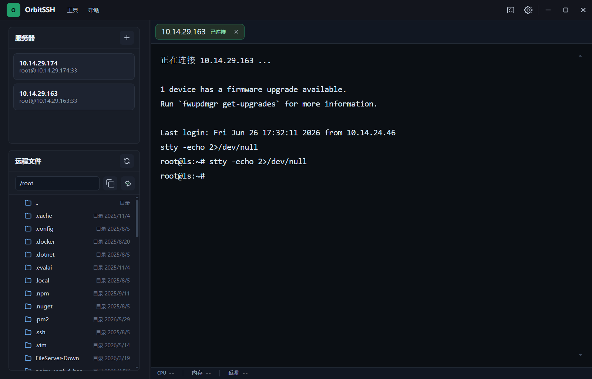
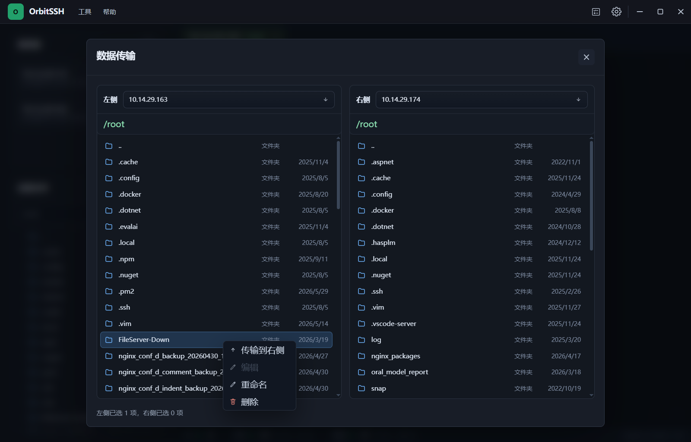
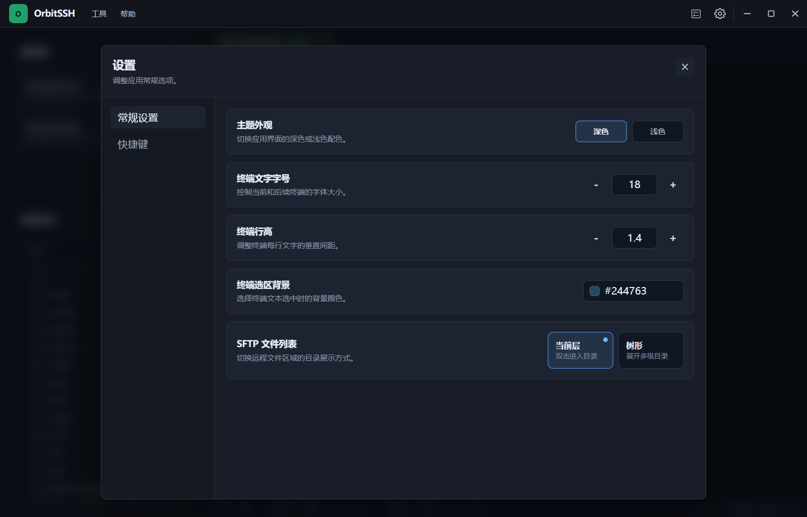

<p align="center">
  
</p>

<h1 align="center">OrbitSSH</h1>

<p align="center">
  <strong>现代化 · 高性能 · 跨平台</strong>
</p>

<p align="center">
  
  
  
  
  
  
</p>

---

## 简介

OrbitSSH 是一款基于 **Electron + Vue 3** 构建的**桌面端 SSH / SFTP 客户端**。它将强大的远程连接能力、多标签页终端管理、可视化文件浏览与传输集成在一个简洁的界面中，面向运维工程师、开发者以及一切需要频繁与远程 Linux 服务器交互的用户。

> 设计目标：在本地获得**接近原生终端的响应速度**，同时拥有现代图形界面的**效率与便利**。

---

## 功能亮点

### 🔌 SSH 终端

- 基于 [xterm.js](https://xtermjs.org/) 的高性能终端仿真，支持 256 色、光标样式、窗口自适应
- 多标签页会话管理，一键切换不同服务器上下文
- 终端内容搜索（内置 [xterm-addon-search](https://github.com/xtermjs/xterm.js/tree/master/addons/addon-search)）
- 系统剪贴板集成，支持选中复制与右键粘贴

### 📁 SFTP 文件管理

- 双栏布局，本地 ⇄ 远程文件浏览一目了然
- 拖拽上传 / 下载，批量操作不阻塞终端
- 远程文件原位编辑，保存自动回传
- 图片在线预览
- 目录间文件同步（双向对比 + 选择性传输）
- 完整的文件 CRUD 操作：新建、重命名、删除

### ⚙️ 服务器管理

- 连接配置本地持久化，支持增删改查与分组整理
- 密码 / 私钥等敏感信息使用系统级安全存储加密保存
- 一键连接、快速重连

### 🎨 主题与外观

- 自定义主题色，终端配色与全局 UI 统一可控
- 自定义窗口标题栏（无原生框架），沉浸式深色默认风格
- 字体大小、行高、光标样式等终端细节可调

### 🔄 版本更新

- 内置 `electron-updater` 自动检查更新，支持 generic 服务器分发
- 更新提示弹窗内下载进度可见，安装一键完成

---

## 界面预览

| 终端主页 | SFTP 文件传输 | 设置面板 |
|:---:|:---:|:---:|
|  |  |  |

---

## 技术架构

```
┌──────────────────────────────────────────────┐
│                  Renderer                     │
│          Vue 3 + Pinia + TypeScript           │
│   ┌──────────┬──────────┬──────────┐         │
│   │ Terminal │  SFTP    │ Settings │         │
│   │  Panel   │  Panel   │  Dialog  │         │
│   └──────────┴──────────┴──────────┘         │
├──────────────────────────────────────────────┤
│                 Preload                       │
│        contextBridge (安全隔离)               │
├──────────────────────────────────────────────┤
│               Main Process                    │
│         Electron + Node.js                    │
│   ┌──────┬──────┬──────┬──────┬──────┐       │
│   │ SSH  │ SFTP │Store │Update│Logger│       │
│   │Mgr   │Mgr   │      │      │      │       │
│   └──────┴──────┴──────┴──────┴──────┘       │
└──────────────────────────────────────────────┘
```

关键设计原则：

- **进程隔离**：启用 `contextIsolation` + `sandbox`，Renderer 无权直接访问 Node.js —— 所有系统能力通过 `ipcMain` / `ipcRenderer` 按需暴露
- **连接复用**：SSH 会话在 Main 进程内持久化，窗口关闭时自动清理
- **安全优先**：`nodeIntegration: false`，preload 脚本是 Renderer 与系统之间的唯一桥梁

---

## 技术栈

| 层级 | 技术 |
|:---|:---|
| 桌面框架 | Electron 37 |
| 前端框架 | Vue 3 (Composition API) |
| 状态管理 | Pinia |
| 终端模拟 | xterm.js 5 + Canvas 渲染 |
| SSH 协议 | ssh2 |
| SFTP 协议 | ssh2-sftp-client |
| 代码编辑器 | CodeMirror 6 |
| 本地持久化 | electron-store |
| 自动更新 | electron-updater |
| 构建工具 | Vite + electron-builder |
| 语言 | TypeScript (strict) |

---

## 快速开始

### 环境要求

- **Node.js** ≥ 22
- **npm** ≥ 9
- Windows / macOS / Linux

### 克隆项目

```bash
git clone https://gitee.com/ksdhy/orbit-ssh
cd orbitssh
```

### 安装依赖

```bash
npm install
```

### 开发模式

启动 Vite 开发服务器 + Electron 窗口（支持 HMR）：

```bash
npm run dev:electron
```

### 构建与打包

```bash
# 仅构建输出到 dist / dist-electron
npm run build

# 构建并打 Windows 安装包（输出到 release/）
npm run dist
```

---

## 项目结构

```
orbitssh/
├── src/
│   ├── main/                    # Electron 主进程
│   │   ├── index.ts            # 应用入口，窗口创建 & IPC 注册
│   │   ├── ipc/                # IPC 处理器
│   │   │   ├── server-ipc.ts   # 服务器连接配置管理
│   │   │   ├── terminal-ipc.ts # 终端会话 IPC
│   │   │   ├── sftp-ipc.ts     # 文件传输 IPC
│   │   │   ├── settings-ipc.ts # 应用设置读写
│   │   │   ├── clipboard-ipc.ts# 剪贴板读写
│   │   │   ├── dialog-ipc.ts   # 原生对话框
│   │   │   ├── window-ipc.ts   # 窗口控制（最小化/最大化/关闭）
│   │   │   ├── system-ipc.ts   # 系统信息
│   │   │   ├── update-ipc.ts   # 应用更新
│   │   │   └── logger-ipc.ts   # 日志通道
│   │   ├── ssh/                # SSH 会话管理
│   │   │   ├── session-manager.ts
│   │   │   └── auth-options.ts
│   │   ├── sftp/               # SFTP 会话管理
│   │   │   └── sftp-manager.ts
│   │   ├── storage/            # 本地持久化存储
│   │   │   ├── server-store.ts
│   │   │   └── settings-store.ts
│   │   ├── update/             # 自动更新模块
│   │   │   └── index.ts
│   │   └── logger.ts           # 应用日志
│   ├── preload/                # 预加载脚本（contextBridge 安全暴露 API）
│   │   ├── index.ts
│   │   └── index.cjs
│   ├── renderer/               # Vue 渲染进程
│   │   ├── components/         # UI 组件
│   │   ├── assets/             # 图标 & 静态资源
│   │   ├── styles.css          # 全局样式
│   │   └── App.vue             # 根组件
│   └── shared/                 # 主进程 ⇄ 渲染进程共享类型定义
│       ├── server.ts
│       ├── settings.ts
│       ├── sftp.ts
│       └── terminal.ts
├── docs/                       # 文档 & 截图
├── build/                      # 构建资源（图标、NSIS 脚本）
├── scripts/                    # 辅助脚本
├── vite.config.ts
├── tsconfig.json
├── tsconfig.electron.json
├── package.json
└── README.md
```

---

## 使用说明

### 连接管理

1. 点击左侧栏 **+** 按钮打开连接对话框
2. 填写主机地址、端口、认证方式（密码 / 私钥）
3. 保存后点击服务器条目即可建立连接
4. 右键服务器条目查看更多操作

### 终端操作

- 点击标签页切换不同会话，支持横向滚动
- `Ctrl+F` / `Cmd+F` 搜索终端输出
- 选中文本自动复制，右键粘贴
- 标签页右键可关闭或重新连接

### 文件传输

- 连接成功后可通过**分屏视图**或**侧边栏**打开 SFTP 面板
- 拖拽文件/文件夹到对侧面板完成上传/下载
- 双击远程文本文件触发原位编辑
- 点击**同步路径**按钮启动目录同步

---

## 配置

应用配置通过 `electron-store` 持久化到本地用户数据目录，支持：

| 分类 | 可配置项 |
|:---|:---|
| 主题 | 主题色、终端配色、终端背景色 |
| 终端 | 字体大小、字体族、行高、光标样式 |
| 行为 | 窗口状态记忆、确认对话框偏好 |
| 更新 | 更新服务器地址、自动检查开关 |

---

## 贡献指南

欢迎提交 Issue 和 Pull Request！

1. Fork 本仓库
2. 基于 `master` 创建功能分支：`git checkout -b feat/my-feature`
3. 提交更改并附上清晰的 commit message
4. 推送分支并发起 Pull Request

> 提交前请确保通过类型检查：`npm run build`

---

## 许可证

本项目基于 [MIT License](LICENSE) 发布。

---

<p align="center">
  <sub>Made with ❤️ by ksdhy</sub>
</p>
